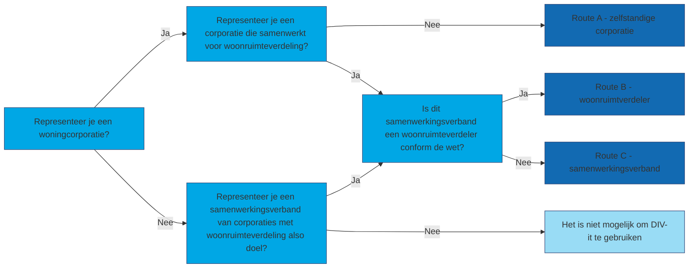

#De implementatieroute

De situatie van jouw organisatie is bepalend voor de route die je volgt bij het implementeren van de digitale inkomensverklaring. Gebruik de beslisboom om te achterhalen welke route voor jou van toepassing is.

In de praktijk komen er verschillende samenwerkingsvarianten tussen corporaties voor bij het woonruimteverdeelproces. Dit kan leiden tot verschillende rollen en bijbehorende acties in de uitrol van de digitale inkomensverklaring. De onderstaande beslisboom helpt om te bepalen welke acties uitgevoerd moeten worden en door wie.

## De beslisboom

## Route A: Zelfstandige woningcorporatie
**Rol**: U bent een woningcorporatie die bij de woonruimteverdeling niet samenwerkt met andere corporaties.

*De corporatie…*

* Zorgt dat bestaande samenwerkingsafspraken en verwerkersovereenkomsten aangepast worden.
* Is gedurende elke fase van het woonruimtebemiddelingsproces verwerkingsverantwoordelijk voor de verwerking van de digitaal opgehaalde gegevens.
* Is opdrachtgever voor de softwareleverancier of dienstenleverancier die de woningcorporatie ondersteunt in de woonruimteverdeling.
* Meldt zich aan bij BZK, Logius en de RvIG als gebruiker.
* Ontvangt de rekening van MijnOverheid.

## Route B: Woonruimteverdeler
**Rol**: Het samenwerkingsverband is een woonruimteverdeler in de zin van de Woningwet.

*De woonruimteverdeler…*

* Coördineert de implementatie van DIV-it namens de aangesloten corporaties in het samenwerkingsverband.
* Is verwerkingsverantwoordelijke voor de verwerking van de digitaal opgehaalde gegevens vanaf inschrijving van de woningzoekende tot en met de acceptatie van een door de woningcorporatie aangeboden woning door de woningzoekende. Dat is inclusief de verwerking van het gevalideerde inkomen van een woningzoekende dat via MijnOverheid wordt gedeeld met de woonruimteverdeler.
* Zorgt dat bestaande samenwerkingsafspraken en verwerkersovereenkomsten aangepast worden. 
* Is opdrachtgever voor de softwareleverancier of dienstenleverancier die de woonruimteverdeler ondersteunt in de woonruimteverdeling voor de aangesloten woningcorporaties.
* Coördineert de aanmelding bij BZK van de aangesloten corporaties in het samenwerkingsverband inclusief de eigen aanmelding en stuurt de aanmeldingen gezamenlijk in.
* Meldt zich aan als gebruiker bij Logius en de RvIG.
* Ontvangt de rekening van MijnOverheid en verrekent deze met de aangesloten corporaties.

## Route C: Samenwerkingsverband
**Rol**: U bent een samenwerkingsverband van woningcorporaties en uw samenwerkingsverband heeft woonruimteverdeling als doelstelling. Maar u bent geen woonruimteverdeler in de zin van de Woningwet. Uit de aangesloten corporaties wordt een Primus Inter Pares aangewezen.

**Primus Inter Pares**

Er kan sprake zijn van een situatie waarin er sprake is van een samenwerkingsverband van woningcorporaties met woonruimteverdeling als doelstelling van de samenwerking, maar waarin het samenwerkingsverband geen woonruimteverdeler is in de zin van de Woningwet. In dit geval wijzen de aangesloten corporaties een van de woningcorporaties aan als Primus Inter Pares. Deze Primus Inter Pares heeft dezelfde rechten en verantwoordelijkheden als de andere corporaties maar heeft daarnaast een coördinerende rol in de afstemming binnen het samenwerkingsverband, met de overheidspartijen en met de softwareleverancier of dienstenleverancier van het woonruimteverdeelsysteem.

Het is nodig om een Primus Inter Pares aan te wijzen omdat maar een van de corporaties binnen het samenwerkingsverband zich kan aanmelden bij Logius en RvIG. Deze corporatie wordt daarmee contactpersoon (technisch en organisatorisch) voor de overheidspartijen. Om de samenhang te bewaken is het belangrijk dat de Primus Inter Pares alle onderstaande taken op zich neemt.

**De Primus Inter Pares…**

* Coördineert de implementatie van DIV-it namens de aangesloten corporaties in het samenwerkingsverband.
* Zorgt dat bestaande samenwerkingsafspraken en verwerkersovereenkomsten aangepast worden.
* Is aanspreekpunt voor de softwareleverancier of dienstenleverancier die het samenwerkingsverband ondersteunt in de woonruimteverdeling voor de aangesloten woningcorporaties.
* Coördineert de aanmelding bij BZK van de aangesloten corporaties in de regio inclusief de eigen aanmelding en stuurt de aanmeldingen gezamenlijk in.
* Meldt zich aan als gebruiker bij Logius en de RvIG.
* Ontvangt de rekening van MijnOverheid en verrekent deze met de aangesloten corporaties;
* In deze situatie zijn de corporaties die aangesloten zijn bij het samenwerkingsverband gezamenlijk verwerkingsverantwoordelijk voor de verwerking van de digitaal opgehaalde gegevens vanaf inschrijving van de woningzoekende tot en met de acceptatie van een door de woningcorporatie aangeboden woning door de woningzoekende. Dat is inclusief de verwerking van het gevalideerde inkomen van een woningzoekende dat via MijnOverheid wordt gedeeld. Ook bezien vanuit AVG-perspectief heeft de Primus Inter Pares dezelfde rechten en verantwoordelijkheden als de andere corporaties.