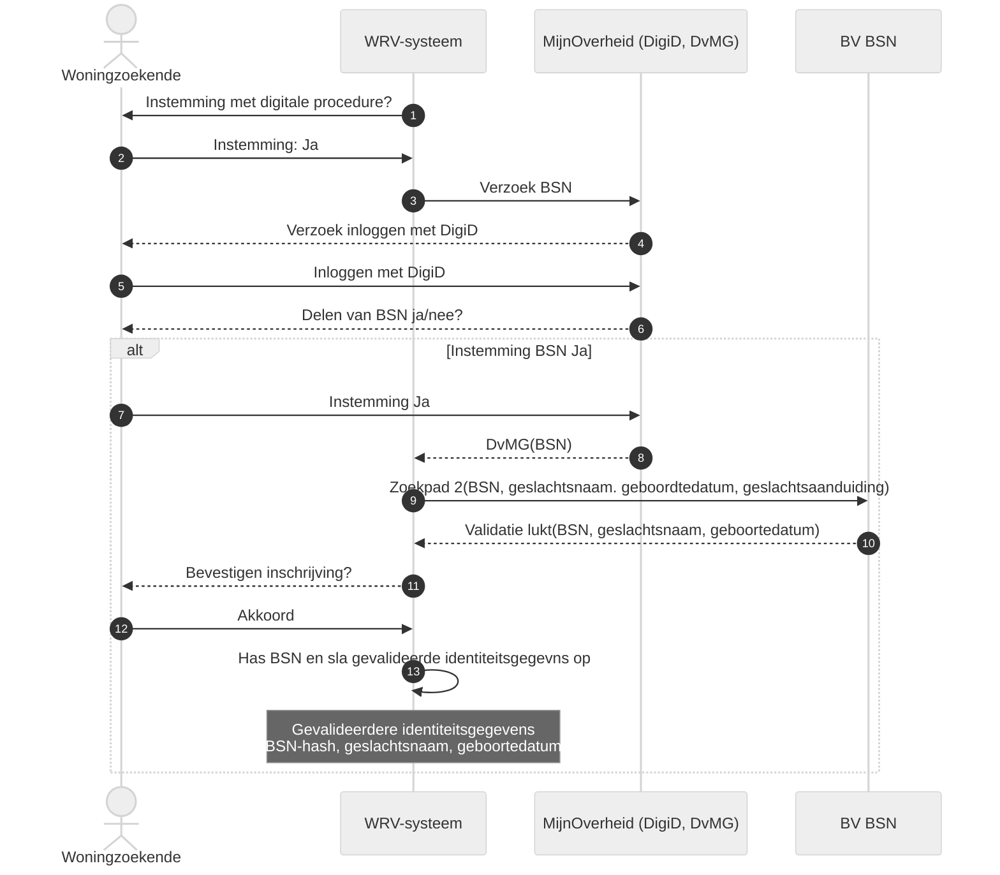

**Stap 1-3. Instemming met digitale procedure**

De woonruimteverdeler of corporatie verstrekt aan de woningzoekende informatie over het hoe en waarom van het digitaal verstrekken van de gegevens en de daarbij behorende gegevensverwerkingen ((zie ook: [Vragen van instemming](./vragen_van_instemming.md) en [Intrekken van instemming](./intrekken_van_instemming.md)). De woonruimteverdeler of woningcorporatie vraagt of de woningzoekende instemt met de digitale procedure om het BSN te delen. Als de woningzoekende instemt met de digitale procedure roept het woonruimteverdeelsysteem MijnOverheid aan. Via MijnOverheid kan de woningzoekende het BSN delen.

**Stap 4-5. Inloggen met DigiD**

De woningzoekende logt met DigiD in op de MijnOverheid-omgeving.

**Stap 6-7. Delen van BSN**

De woningzoekende krijgt het BSN te zien in de MijnOverheid-omgeving en wordt gevraagd of hij deze wil verstrekken aan de woonruimteverdeler of corporatie. Als de woningzoekende het BSN wil delen wordt dit verstrekt aan de woonruimteverdeler of corporatie via het koppelvlak Delen van mijn Gegevens.

**Stappen 8-12. Validatie BV BSN**

Op basis van het BSN raadpleegt het woonruimteverdeelsysteem op de achtergrond de Beheervoorziening BSN (BV BSN) met de verificatievraag ‘Toetsen van de combinatie BSN en identificerende gegevens’. De woonruimteverdeler of corporatie kan zo met de BV BSN controleren of de set van identificerende gegevens die de woningzoekende heeft opgegeven overeenkomt met de set van identificerende gegevens in de Basisregistratie Personen (BRP, een registratie van de overheid) behorende bij een BSN. De woonruimteverdeler of corporatie gebruikt daarvoor zoekpad 2.

In de BV BSN worden [BSN, geslachtsnaam, geboortedatum, geslachtsaanduiding] van de woningzoekende gecontroleerd (zoekpad 2). Als de validatie lukt via zoekpad 2, ontvangt het woonruimteverdeelsysteem het BSN en de gevalideerde geslachtsnaam en geboortedatum van de woningzoekende. De woonruimteverdeler of corporatie toont de gevalideerde geslachtsnaam en geboortedatum aan de woningzoekende ter controle. Als de woningzoekende akkoord gaat met het gebruik van de gegevens ten behoeve van de inschrijving, verstuurt hij deze instemming aan het woonruimteverdeelsysteem.

**Stap 13. Hashen van het BSN en opslaan van gevalideerde gegevens**

De woonruimteverdeler of woningcorporatie gebruikt een technische oplossing om het BSN te beveiligen zodat het opgeslagen BSN niet direct herleidbaar is tot het BSN van de desbetreffende persoon. Het BSN wordt ook niet getoond aan gebruikers van het woonruimteverdeelsysteem.

Het BSN wordt in het woonruimteverdeelsysteem gehasht opgeslagen zodat deze niet gemakkelijk te herleiden is naar de betreffende persoon.

In het woonruimteverdeelsysteem worden, naast het gehashte BSN, de identiteitsgegevens (geslachtsnaam, geboortedatum) die gevalideerd zijn in de stappen 8-12 bewaard. De andere gegevens die gebruikt zijn voor de digitale procedure (geslachtsaanduiding) moeten verwijderd worden uit het woonruimteverdeelsysteem.