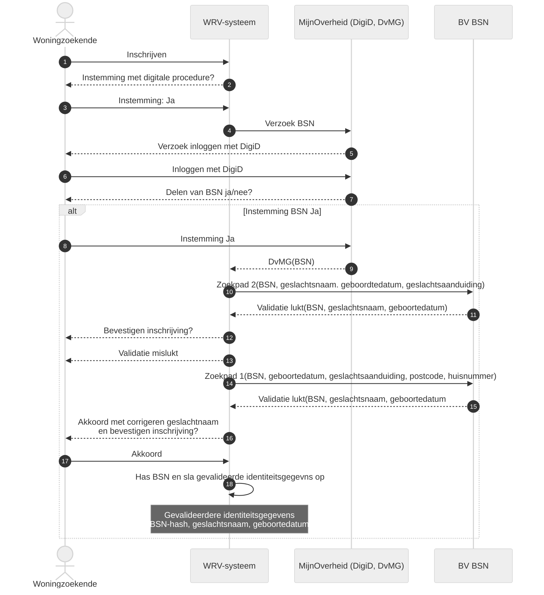

**Stap 1. Inschrijven**

De woningzoekende schrijft zich in bij de woonruimteverdeler of corporatie. Gegevens uit het inschrijfformulier die van belang zijn voor de digitale procedure zijn:

* Geslachtsnaam

* Geboortedatum

* Geslachtsaanduiding (M/V/X. De geslachtsaanduiding moet corresponderen met de registratie in het paspoort)

* Huisnummer

* Postcode

Deze gegevens worden opgeslagen in het woonruimteverdeelsysteem.

**Stap 2-4. Instemming met digitale procedure**

De woonruimteverdeler of corporatie verstrekt aan de woningzoekende informatie over het hoe en waarom van het digitaal verstrekken van de gegevens en de daarbij behorende gegevensverwerkingen (zie ook: [Vragen van instemming](./vragen_van_instemming.md) en [Intrekken van instemming](./intrekken_van_instemming.md)). De woonruimteverdeler of woningcorporatie vraagt of de woningzoekende instemt met de digitale procedure om het BSN te delen. Als de woningzoekende instemt met de digitale procedure roept het woonruimteverdeelsysteem MijnOverheid aan. Via MijnOverheid kan de woningzoekende het BSN delen.

**Stap 5-6. Inloggen met DigiD**

De woningzoekende logt met DigiD in op de MijnOverheid-omgeving.

**Stap 7-9. Delen van BSN**

De woningzoekende krijgt het BSN te zien in de MijnOverheid-omgeving en wordt gevraagd of hij deze wil verstrekken aan de woonruimteverdeler of corporatie. Als de woningzoekende het BSN wil delen wordt dit verstrekt aan de woonruimteverdeler of corporatie via het koppelvlak Delen van mijn Gegevens.

**Stappen 10 -17. Validatie BV BSN**

Op basis van het BSN raadpleegt het woonruimteverdeelsysteem op de achtergrond de Beheervoorziening BSN (BV BSN) met de verificatievraag ‘Toetsen van de combinatie BSN en identificerende gegevens’. De woonruimteverdeler of corporatie kan zo met de BV BSN controleren of de set van identificerende gegevens die de woningzoekende heeft opgegeven overeenkomt met de set van identificerende gegevens in de Basisregistratie Personen (BRP, een registratie van de overheid) behorende bij een BSN. De woonruimteverdeler of corporatie gebruikt daarvoor eerst zoekpad 2 en als validatie via zoekpad 2 niet lukt, zoekpad 1. Het proces dat volgt op de beide zoekpaden wordt hieronder uitgelegd.

Let op: bij het bevragen van de BV BSN wordt de geslachtsaanduiding die de woningzoekende doorgeeft in stap 1. Inschrijven gebruikt. De geslachtsaanduiding X in het paspoort, dus zoals de woningzoekende doorgeeft, staat in de BRP geregistreerd als een O (onbekend). Daarom moet de geregistreerde geslachtsaanduiding X in het woonruimteverdeelsysteem vertaald worden naar een O voordat de BV BSN bevraagd wordt.

**Stap 10 - 12 en stap 17. Zoekpad 2**

In de BV BSN worden [BSN, geslachtsnaam, geboortedatum, geslachtsaanduiding] van de woningzoekende gecontroleerd (zoekpad 2). Als de validatie lukt via zoekpad 2, ontvangt het woonruimteverdeelsysteem het BSN en de gevalideerde geslachtsnaam en geboortedatum van de woningzoekende. De woonruimteverdeler of corporatie toont de gevalideerde geslachtsnaam en geboortedatum aan de woningzoekende ter controle. Als de woningzoekende akkoord gaat met het gebruik van de gegevens ten behoeve van de inschrijving, verstuurt hij deze instemming aan het woonruimteverdeelsysteem (stap 17).

**Stap 13 - 17. Zoekpad 1**

Als de validatie via zoekpad 2 mislukt worden [BSN, geboortedatum, geslachtsaanduiding, huisnummer, postcode] van de woningzoekende gecontroleerd (zoekpad 1). Als de validatie lukt via zoekpad 1, ontvangt het woonruimteverdeelsysteem het BSN en de gevalideerde geslachtsnaam en geboortedatum van de woningzoekende. De woonruimteverdeler of corporatie mag in dit geval de geslachtsnaam in het antwoordbericht van de BV BSN gebruiken om de geslachtsnaam die de woningzoekende heeft opgegeven, in de eigen administratie te corrigeren.

De woonruimteverdeler of corporatie toont de gevalideerde gecorrigeerde geslachtsnaam en geboortedatum aan de woningzoekende ter controle en vraag of hij akkoord is met het corrigeren van geslachtsnaam en de inschrijving wil bevestigen. Als de woningzoekende akkoord gaat met het gebruik van de gegevens ten behoeve van de inschrijving, verstuurt hij deze instemming aan het woonruimteverdeelsysteem (stap 17).

**Stap 18. Hashen van het BSN en opslaan van gevalideerde gegevens**

De woonruimteverdeler of woningcorporatie gebruikt een technische oplossing om het BSN te beveiligen zodat het opgeslagen BSN niet direct herleidbaar is tot het BSN van de desbetreffende persoon. Het BSN wordt ook niet getoond aan gebruikers van het woonruimteverdeelsysteem.

Het BSN wordt in het woonruimteverdeelsysteem gehasht opgeslagen zodat deze niet gemakkelijk te herleiden is naar de betreffende persoon.

In het woonruimteverdeelsysteem worden, naast het gehashte BSN, de identiteitsgegevens (geslachtsnaam, geboortedatum) die verkregen zijn in stap 1 en gevalideerd zijn in de stappen 10-17 bewaard. De andere gegevens die gebruikt zijn voor de digitale procedure (geslachtsaanduiding, huisnummer, postcode) moeten verwijderd worden uit het woonruimteverdeelsysteem.