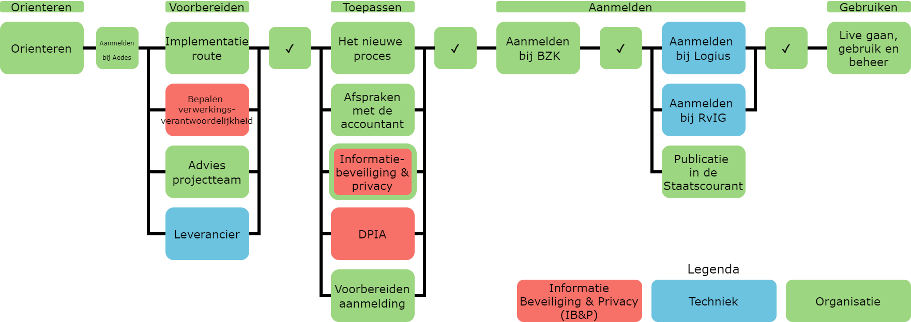
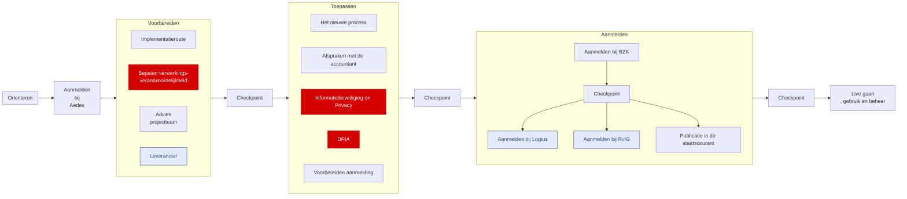

# Routekaart
Op de routekaart zoals hieronder staan alle belangrijke stappen die jouw organisatie zal nemen om de digitale inkomensverklaring te implementeren.

De implementatie bestaat uit een aantal delen:

1. Voorbereiding: Alle stappen die je neemt om je voor te bereiden op de implementatie.
2. Het nieuwe proces toepassen: Alle stappen om het nieuwe proces toe te passen.
3. Aanmelden bij BZK: Om toegewezen te worden als gebruiker van de digitale inkomensverklaring.
4. Aanmelden bij Logius en RvIG: Bij Logius om gebruik te maken van de koppeling “Delen van Mijn Gegevens” en bij de RvIG om gebruik te maken van de Beheervoorziening BSN (BV BSN).
5. Livegang, gebruik en beheer: Wanneer ben je klaar voor livegang? En wat volgt daarna?

Daarnaast zijn er een aantal “check-in”-momenten, wanneer het DIV-it-team graag via een formulier van je hoort hoe ver je bent met de implementatie van de digitale inkomensverklaring. Je zal deze check-in momenten vanzelf tegenkomen.

|Link|Beschrijving|
|-|-|
|  [Voorbereiding](./01_voorbereiding/index.md) | Alle stappen die je neemt om je voor te bereiden op de implementatie.|
|  [Toepassen nieuwe proces](./03_het_nieuwe_proces/index.md) |  Alle stappen om het nieuwe proces toe te passen.|
|  [Aanmelden bij BZK](./03_aanmelden_bzk.md) |Om toegewezen te worden als gebruiker van de digitale inkomensverklaring.|
|  [Aanmelden bij Logius en RvIG](./04_aanmelden_logius_rvig.md) | Bij Logius om gebruik te maken van de koppeling “Delen van Mijn Gegevens” en bij de RvIG om gebruik te maken van de Beheervoorziening BSN (BV BSN)..|
|  [Livegang, gebruik en beheer](./05_livegang_gebruik_en_beheer.md) |Wanneer ben je klaar voor livegang? En wat volgt daarna?|

Daarnaast zijn er een aantal “check-in”-momenten, wanneer het DIV-it-team graag via een formulier van je hoort hoe ver je bent met de implementatie van de digitale inkomensverklaring. Je zal deze check-in momenten vanzelf tegenkomen.